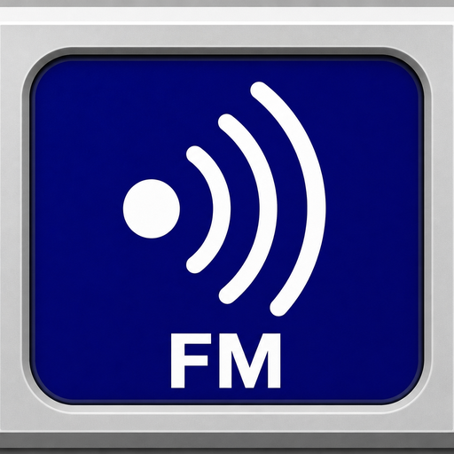

# SDR FM

Desktop wideband FM receiver for **RTL-SDR**, built with **Tauri**, **Angular**, and **FutureSDR**.

Tune FM broadcast stations, manage a personal preset list, and listen through your default audio output — in a compact Winamp-inspired UI.



## Features

- **RTL-SDR WBFM reception** — demodulate FM broadcast stations (64–108 MHz)
- **Station presets** — add, edit, and remove stations; list sorted by frequency
- **Persisted config** — presets saved to `~/.sdr-fm/stations.json` (oxide-style user config)
- **Winamp-style UI** — compact 480×360 window, gray metal chrome, playlist-like station list
- **Aller typeface** — bundled app font for a consistent look

## Prerequisites

### Build tools

- [Node.js](https://nodejs.org/) (v18+)
- [Rust](https://www.rust-lang.org/tools/install)

### RTL-SDR system libraries

The app uses **FutureSDR + SoapySDR** to talk to the dongle. Three packages are required:

| Package | Purpose |
|---------|---------|
| `soapysdr` | SDR hardware abstraction layer |
| `librtlsdr` | Low-level RTL-SDR USB driver |
| `soapyrtlsdr` | SoapySDR plugin for RTL-SDR (**required** — without it you get `Device::make() no match`) |

**macOS (Homebrew):**

```bash
brew install soapysdr librtlsdr soapyrtlsdr
```

**Linux (Debian/Ubuntu):**

```bash
sudo apt install libsoapysdr-dev soapysdr-module-rtlsdr librtlsdr-dev
```

### Verify the dongle

Plug in your RTL-SDR, then:

```bash
SoapySDRUtil --find
SoapySDRUtil --probe="driver=rtlsdr"
```

You should see your device listed (e.g. `RTL-SDR Blog V4`, `driver = rtlsdr`). If `--find` returns *No devices found*, install `soapyrtlsdr` / `soapysdr-module-rtlsdr` and replug the dongle.

Optional low-level check with librtlsdr tools:

```bash
rtl_test
```

### Hardware

- RTL-SDR v4 (or compatible) dongle connected via USB

## Development

```bash
npm install
npm run tauri dev
```

If you hit stale Cargo cache errors (e.g. paths from an old project name), run:

```bash
npm run tauri:clean
npm run tauri dev
```

## Usage

### Listen

1. Select a station in the **Freq / Name** list.
2. Click **Start** to tune the RTL-SDR and begin playback.
3. Click **Stop** to release the device.

While a station is playing, the list and preset editing are frozen.

### Manage stations

| Action | How |
|--------|-----|
| **Add** | Click **+** in the list header |
| **Edit** | Double-click a row |
| **Delete** | Select a row, click **×**, confirm |

- **Frequency** is entered in MHz (e.g. `101.5`). Valid range: **64.0–1080.0 MHz** (FM band).
- **Name** is optional.
- Changes are saved immediately to disk.

Default presets are used when no config file exists or the file is empty. After the first edit, stations are stored in:

```
~/.sdr-fm/stations.json
```

### Status bar

Shows tuning state, success messages, and errors (device missing, invalid frequency, save failures).

## How it works

```
Angular UI  ──invoke──▶  Tauri commands  ──▶  SdrPlayer (Rust)
                              │
                              ├── FutureSDR flowgraph: RTL-SDR → WBFM demod → de-emphasis → audio
                              └── ~/.sdr-fm/stations.json  (preset persistence)
```

- The Rust backend opens the RTL-SDR via **SoapySDR** (`driver=rtlsdr`).
- A **FutureSDR** flowgraph demodulates WBFM in-process: decimate → phase discriminator → resample → de-emphasis.
- Audio plays through your default output via **cpal** (`AudioSink` at 48 kHz).
- Station presets load/save through Tauri commands backed by a JSON config file in the user home directory.

## Project layout

```
src/                    Angular frontend (Winamp UI, station CRUD)
src-tauri/              Rust backend (SDR, DSP, config)
  src/config/           ~/.sdr-fm/stations.json load/save
  src/dsp/              FutureSDR WBFM flowgraph
  icons/                App icon set (macOS, Windows, Linux)
```

## Build

```bash
npm run tauri build
```

The packaged app will be in `src-tauri/target/release/bundle/`.

### Regenerate icons

Icons are generated from a square source PNG:

```bash
npm run tauri icon path/to/square-icon.png
```

This overwrites `src-tauri/icons/` (PNG, ICNS, ICO, and platform-specific assets).

### Raspberry Pi (Linux ARM64)

**Yes — but you build on the Pi itself**, not as a macOS app and not by cross-compiling from your Mac.

Raspberry Pi runs **Linux on ARM** (typically `aarch64` on Pi 4/5 with 64-bit Raspberry Pi OS). Tauri produces a **Linux desktop binary** there. Apple Silicon Macs are also ARM, but they run macOS; a Mac build cannot run on a Pi.

| Approach | Practical for SDR FM? |
|----------|------------------------|
| **Native build on the Pi** (recommended) | Yes |
| Cross-compile macOS → Linux ARM | No — SoapySDR, RTL-SDR, and WebKitGTK need Linux ARM libraries |
| Cross-compile via Docker/QEMU | Possible for experts; slow and fragile for this project |

**Supported targets:** Raspberry Pi **4 / 5** with **64-bit OS** (`aarch64`). 32-bit Pi OS (`armv7`) is not covered here.

**1. System packages on the Pi** (Raspberry Pi OS / Debian):

```bash
sudo apt update
sudo apt install \
  libwebkit2gtk-4.1-dev \
  build-essential \
  curl \
  wget \
  file \
  libssl-dev \
  libayatana-appindicator3-dev \
  librsvg2-dev \
  libclang-dev \
  clang \
  pkg-config \
  libsoapysdr-dev \
  soapysdr-module-rtlsdr \
  librtlsdr-dev
```

`libclang-dev` and `clang` are required because SoapySDR’s Rust bindings (`soapysdr-sys`) use **bindgen** at compile time. Without them you get:

```text
Unable to find libclang ... set the LIBCLANG_PATH environment variable
```

**2. Toolchain on the Pi:**

```bash
# Node.js 18+ (e.g. via NodeSource or nvm)
curl --proto '=https' --tlsv1.2 -sSf https://sh.rustup.rs | sh
```

**3. Clone the repo on the Pi, then build:**

```bash
npm install
npm run tauri build
```

Output: `src-tauri/target/release/bundle/deb/` or `appimage/` (depending on Tauri targets).

**4. RTL-SDR on Pi:** plug in the dongle, verify with `SoapySDRUtil --find`, and ensure your user can access USB (often `sudo usermod -aG plugdev $USER` then re-login).

**Notes:**

- First Rust build on a Pi can take a long time (30+ minutes).
- FM demod is CPU-heavy; Pi 4/5 is recommended.
- On Linux ARM64 the default IQ sample rate is **900 kHz** (vs 1.024 MHz on other platforms) to reduce CPU load. Override with `SDR_FM_SAMPLE_RATE` (768000–3200000).
- The macOS-only spellcheck workaround in the Rust backend is skipped automatically on Linux.

## Performance tuning

### Sample rate

The RTL-SDR IQ sample rate affects CPU use and tuning latency. Defaults:

| Platform | Default |
|----------|---------|
| macOS / Windows / x86 Linux | 1 024 000 Hz |
| Linux ARM64 (Raspberry Pi) | 900 000 Hz |

Override for any platform:

```bash
export SDR_FM_SAMPLE_RATE=768000   # lower CPU; min supported
export SDR_FM_SAMPLE_RATE=1024000  # default on desktop
npm run tauri dev
```

Valid range: **768 000 – 3 200 000** Hz. Values outside that range are ignored.

### Profiling (on target hardware)

Profile the Rust DSP hot path on the machine you care about (especially a Pi), not only on a dev Mac:

```bash
# Install flamegraph tooling once
cargo install flamegraph

# From src-tauri/ — profile while the app is receiving
cd src-tauri
cargo flamegraph --bin sdr_fm
```

Run the packaged app, start playback, tune a station, then stop. Open `flamegraph.svg` to see where CPU time goes (WBFM demod, resampling, SoapySDR read, etc.).

For a release build with symbols:

```bash
CARGO_PROFILE_RELEASE_DEBUG=true cargo flamegraph --release --bin sdr_fm
```

Station changes while playing use a live retune command instead of reopening the device, so switching presets should stay fast after the first Start.

## Tech stack

| Layer | Technology |
|-------|------------|
| UI | Angular 20, signals, Aller font |
| Shell | Tauri 2 |
| SDR | FutureSDR, SoapySDR, RTL-SDR |
| Audio | cpal / rodio via FutureSDR AudioSink |
| Config | serde_json, `~/.sdr-fm/` |

## License

[LICENSE](LICENSE) — MIT License.
